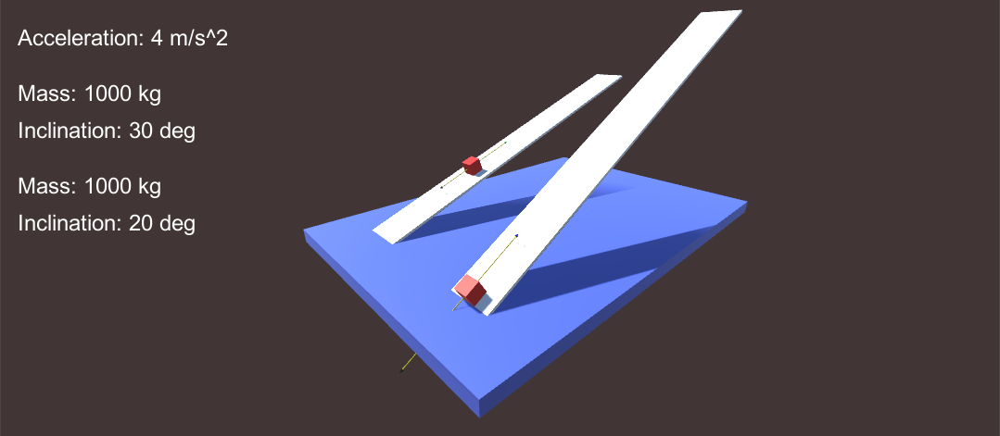
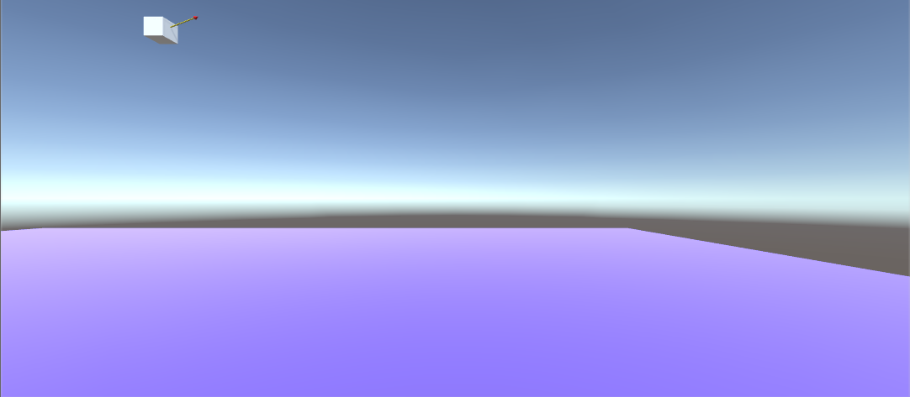
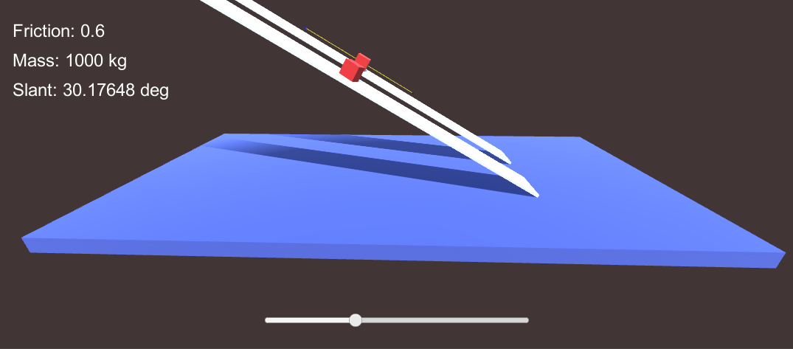
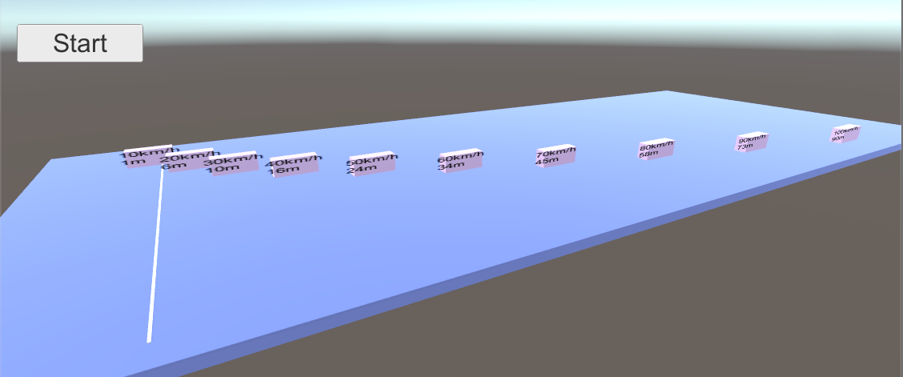
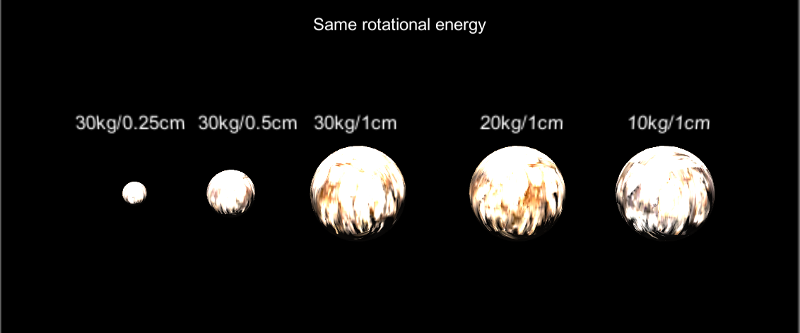

# Basic classical Physics

This project has multiple scenes:

- Free fall
- Pendulum
- Slope
- Vector
- Friction (cube)
- Friction (excavator)
- Brake
- Collision

I have confirmed that all the Physics experiments on Unity follow the lows of Classical Physics.

## Free fall

## Pendulum

## Slope

## Vector

Realtime rendering of velocity vector.

# Friction (Cube)

Comparison between Unity's Physics and real world Physics.

[Note] The friction value in the Physical material used in the simulation is set to 0.3 (that corresponds to 0.6 in real Physics) due to the following reason:

https://docs.unity3d.com/Manual/class-PhysicMaterial.html

"Please note that the friction model used by the Nvidia PhysX engine is tuned for performance and stability of simulation, and does not necessarily present a close approximation of real-world physics. In particular, contact surfaces which are larger than a single point (such as two boxes resting on each other) will be calculated as having two contact points, and will have friction forces twice as big as they would in real world physics. You may want to multiply your friction coefficients by 0.5 to get more realistic results in such a case."

# Friction (Excavator)

One Rigidbody with one Box Collider for each track (left and right tracks). The simulation result is exactly same as the above.

# Brake

# Collision

# Torque, Moment of Inertia and Rotational Energy

# Solar system

This simulation replaces Unity's Gravity (-9.81 m/s^2 of accerelation) with Universal Law of Attraction for simulating the Solar system.

## Code

[=> Code](../BasicClassicalPhysics)

There are multiple scenes in "BasicClassicalPhysics\Assets\Scenes".
